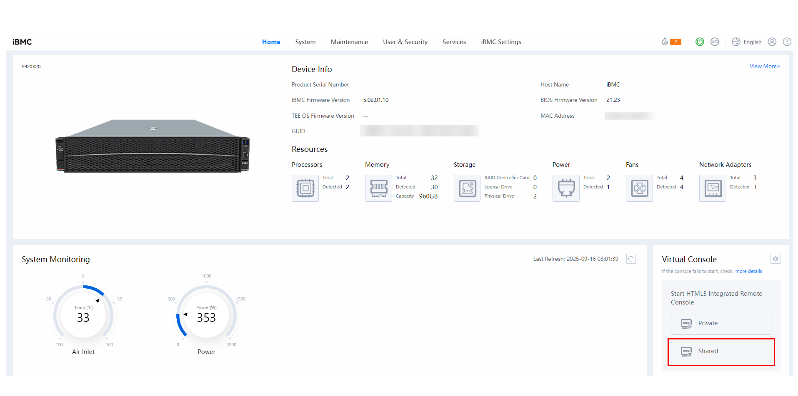
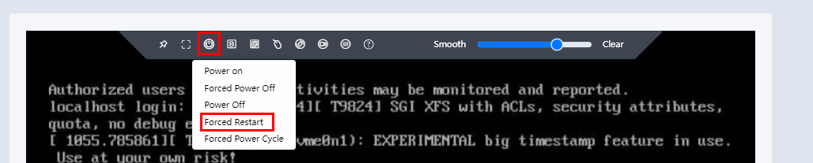
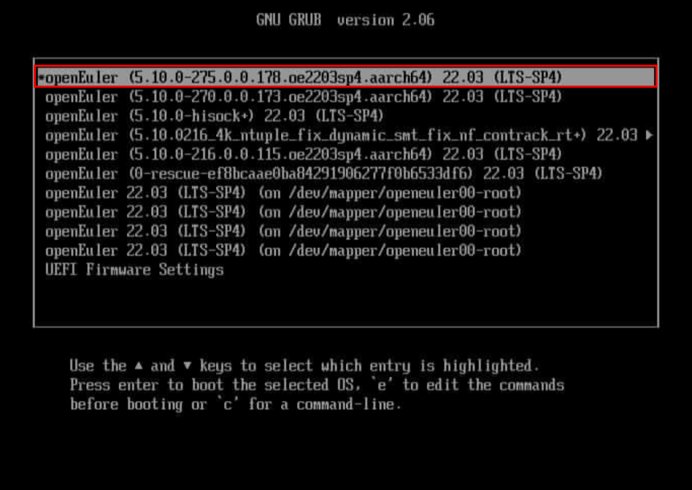
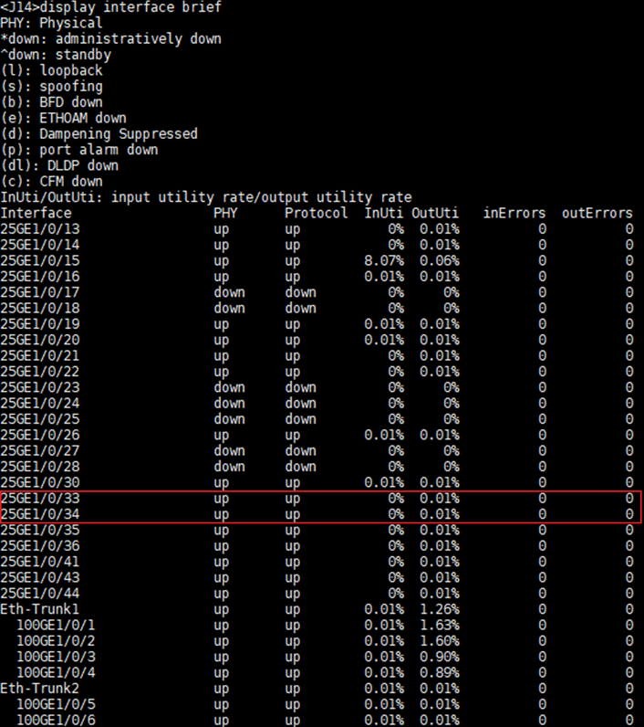
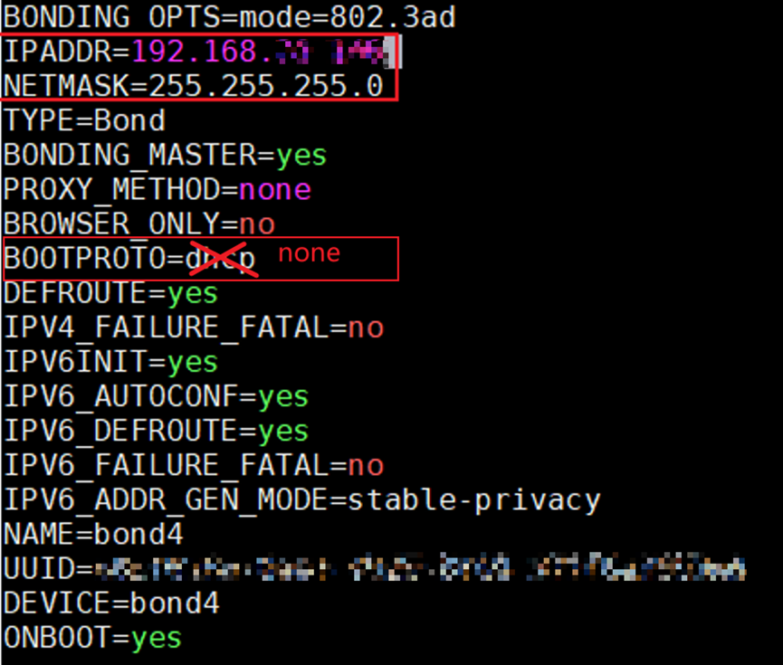
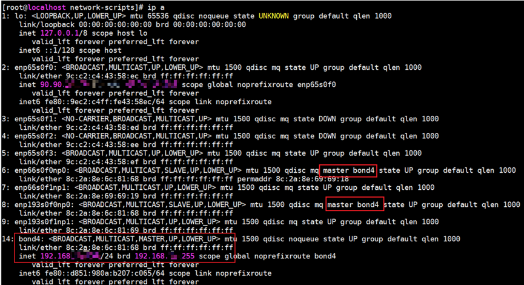
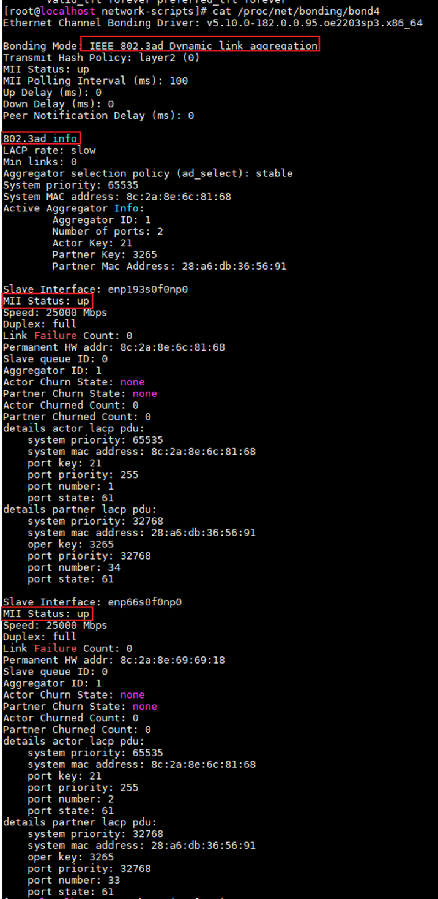
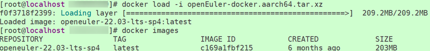
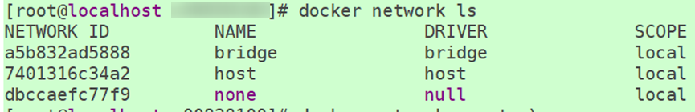

# Redis Network Asynchronization Feature Guide

## Feature Description<a name="EN-US_TOPIC_0000002518399378"></a>

This document describes how to deploy and enable the Redis network asynchronization feature and test its performance on the openEuler OS running on Kunpeng 920 series processors.

Kunpeng Redis Asynchronous I/O (KRAIO) is a batch asynchronous I/O algorithm developed by Kunpeng. The Redis network asynchronization feature enhances performance by offloading network I/O operations to KRAIO for asynchronous batch processing. This reduces system calls and context switching, enabling non-blocking Redis operations and significantly improving throughput. When the submission queue polling (sqpoll) mode is enabled, KRAIO utilizes a dedicated kernel thread to automatically handle network I/O events, eliminating the need for system calls during I/O operations.

The Redis network asynchronization feature implements the KRAIO algorithm via patch files and the KRAIO library to enhance the open-source Redis database. It establishes KRAIO kernel affinity and utilizes the innovative batch asynchronous I/O algorithm for improved performance.

## Environment and Networking Setup<a name="EN-US_TOPIC_0000002549759227"></a>

### Environment Requirements<a name="EN-US_TOPIC_0000002518239452"></a>

This document provides guidance based on the Kunpeng server and openEuler OS. Before performing operations, ensure that your hardware and software meet the requirements.

**Table 1** Hardware requirements<a id="hardware-requirements"></a>

|Item|Specifications|
|--|--|
|CPU|Kunpeng 920 series|
|NIC|2 × 25GE NIC|


**Table 2** OS and software requirements<a id="os-and-software-requirements"></a>

|Item|Version|How to Obtain|
|--|--|--|
|OS|openEuler 22.03 LTS SP4|[Link](https://www.openeuler.org/en/download/archive/detail/?version=openEuler%252022.03%2520LTS%2520SP4)|
|Container|openEuler-docker.aarch64.tar.xz|[Link](https://dl-cdn.openeuler.openatom.cn/openEuler-22.03-LTS-SP4/docker_img/aarch64/openEuler-docker.aarch64.tar.xz)|
|Redis|6.0.20|[Link](https://download.redis.io/releases/redis-6.0.20.tar.gz)|
|Redis|7.0.15|[Link](https://download.redis.io/releases/redis-7.0.15.tar.gz)|
|KRAIO affinity kernel|kernel-5.10.0-275.0.0.178.oe2203sp4.aarch64.rpm or later|Click the [link](https://repo.openeuler.org/openEuler-22.03-LTS-SP4/update/aarch64/Packages/), search for <code>kernel-5.10.0</code> on the page, and download the latest kernel version.<br>The kernel file name is in the format of <code>kernel-5.10.0-xxx.0.0.xxx.oe2203sp4.aarch64.rpm</code>, where <code>xxx</code> indicates the version. A larger value of <code>xxx</code> indicates a later version.|
|KRAIO patch|redis-6.0.20-adapt-iouring.patch|Only Redis 6.0.20 is supported.<br>[Link](https://gitcode.com/boostkit/Redis/blob/master/redis-6.0.20-adapt-iouring.patch)|
|KRAIO patch|redis-7.0.15-adapt-iouring.patch|Only Redis 7.0.15 is supported.<br>[Link](https://gitcode.com/boostkit/Redis/blob/master/redis-7.0.15-adapt-iouring.patch)|
|KRAIO library|libkraio.so and kraio.h|Redis 7.0.15 and Redis 6.0.20 are supported.<br>[Link](https://gitcode.com/boostkit/Redis/releases/download/BoostDB_Redis_1130/kraio.zip)|


> **NOTE:**
>-   This document verifies Redis performance optimization in a Docker-based environment with bond4 and IPVLAN configurations.
>-   This document uses Redis 7.0.15 as an example to describe how to install and enable this feature, as well as how to test its functions and performance. For Redis 6.0.20, you may follow the same instructions, but be sure to update the version number accordingly in all commands.
>-   If the OS uses an openEuler kernel, kernel-5.10.0-275.0.0.178 or later is required. For earlier versions, the patches of bugfix and features such as affinity and timer wakeup must be installed.
>-   If the OS uses a non-openEuler kernel, the kernel version 5.10 or later is required, and the patches of bugfix and features such as affinity and timer wakeup must be installed.

### Replacing the Affinity Kernel<a name="EN-US_TOPIC_0000002549759231"></a>

The network asynchronization feature requires a specific kernel version. Therefore, you need to install an OS kernel compatible with this feature in advance. After the kernel is installed, you can use the OS GRUB tool to change the default kernel boot entry, or use the iBMC remote management interface to replace the default kernel with the kernel that supports the feature.

**Using the CLI<a name="section9307191317373"></a>**

1. Refer to [**Table 2**](#os-and-software-requirements) to download the KRAIO affinity kernel RPM package to the target environment and run the following command in the affinity kernel directory:

    ```
    rpm -ivh kernel-5.10.0-275.0.0.178.oe2203sp4.aarch64.rpm --force
    ```

2. Check the installed kernel and find the index of the KRAIO affinity kernel. Assume that the index is 0.

    ```
    grubby --info=ALL | egrep -i 'index|title'
    ```

3. Replace the default kernel boot entry with the index number 0 of the KRAIO affinity kernel.

    ```
    grubby --set-default-index=0
    ```

4. Check and confirm that the default kernel has been replaced with the KRAIO affinity kernel.

    ```
    grubby --default-kernel 
    ```

    

5. Reboot the server.

    ```
    reboot
    ```

**Using the iBMC<a name="section1987503243710"></a>**

1. Download the KRAIO affinity kernel RPM package to the target environment and run the following command in the affinity kernel directory:

    ```
    rpm -ivh kernel-5.10.0-275.0.0.178.oe2203sp4.aarch64.rpm --force
    ```

2. Log in to the iBMC.

    

3. Open the remote virtual console.

    

4. Forcibly restart the machine.

    

5. Select the KRAIO affinity kernel and wait until the restart is complete.

    


### (Optional) Configuring Bond4<a name="EN-US_TOPIC_0000002518239448"></a>

If you need to set up a Docker-based environment with bond4 and IPVLAN configurations, configure bond4 as instructed in this section. Otherwise, skip this section.

Bond4 refers to mode 4 in network interface bonding, technically designated as IEEE 802.3ad Link Aggregation Control Protocol (LACP). This configuration enhances bandwidth capacity and ensures redundancy by aggregating multiple physical network interfaces into a single logical interface.

Implementing bond4 requires coordinated configuration on both the server and network switch, with prerequisite knowledge of the physical ports of the switch corresponding to the two NICs of the server designated for bonding, and the switch IP address.

**Configuring Dynamic LACP on the Switch<a name="section673713294454"></a>**

1. Log in to the switch.
2. Check all available physical ports on the switch.

    ```
    display interface brief
    ```

    

    > **NOTE:**
    >As shown in the preceding figure, the ports on the switch corresponding to the two NICs (`eth1` and `eth2`) to form a bond4 group on the server are in the `up` state and not part of any Eth-Trunk group. This example demonstrates bond4 configuration using ports `25GE 1/0/33` and `25GE 1/0/34`.

3. Create an Eth-Trunk 12 group and add `25GE 1/0/33` and `25GE 1/0/34` to the group.

    ```
    system-view 
    interface Eth-Trunk 12 
    mode lacp-dynamic 
    trunkport 25GE 1/0/33 
    trunkport 25GE 1/0/34 
    commit 
    quit 
      
    interface 25GE 1/0/33 
    eth-trunk 12 
    commit 
    quit 
      
    interface 25GE 1/0/34 
    eth-trunk 12 
    commit 
    quit
    ```

    

**Configuring the Server<a name="section10576182552614"></a>**

To configure NICs `eth1` and `eth2` as a bond4 interface, log in to the server and follow the steps below.

1. Log in to the server.
2. Disable network connectivity for `eth1` and `eth2`.

    ```
    nmcli con down eth1 
    nmcli con down eth2
    ```

3. Back up the `/etc/sysconfig/network-scripts/ifcfg-eth1` and `/etc/sysconfig/network-scripts/ifcfg-eth2` configuration files for `eth1` and `eth2`, and delete the original files.

    ```
    cd /etc/sysconfig/network-scripts 
    cp ifcfg-eth1 ifcfg-eth1.bak 
    cp ifcfg-eth2 ifcfg-eth2.bak
    rm -rf ifcfg-eth1
    rm -rf ifcfg-eth2
    ```

4. Create an 802.3ad-compliant bond4 interface using `eth1` and `eth2`.

    ```
    nmcli con add type bond con-name bond4 ifname bond4 mode 802.3ad 
    nmcli con add type bond-slave ifname eth1 master bond4 
    nmcli con add type bond-slave ifname eth2 master bond4 
    nmcli con up bond-slave-eth1 
    nmcli con up bond-slave-eth2 
    nmcli con up bond4
    ```

5. Modify the bond4 interface configuration file.

    ```
    vi /etc/sysconfig/network-scripts/ifcfg-bond4
    ```

    Add an IP address and change `BOOTPROTO=dhcp` to `BOOTPROTO=none`.

    ```
    IPADDR=192.168.xx.xx 
    NETMASK=255.255.255.0 
    BOOTPROTO=none
    ```

    

6. Restart the network service and bond4 interface.

    ```
    service NetworkManager restart 
    nmcli con down bond4 
    nmcli con up bond4
    ```

7. Check network information about the bond4 interface.

    ```
    ip a | grep -C 5 bond4  
    ip a
    ```

    

8. Check the bond4 interface status.

    ```
    cat /proc/net/bonding/bond4
    ```

    

    The bond4 configuration is correct if the following conditions are met:

    - `Bonding Mode` is `IEEE 802.3ad Dynamic link aggregation`.
    - `MII Status` is `up`.
    - The servers use the bond4 IP address and can connect to each other.

**Checking the Bond4 Configuration on the Switch<a name="section143079151714"></a>**

Following successful server-side bond4 setup, verify the `Eth-Trunk 12` configuration on the switch.

```
display eth-trunk 12
```


The bond4 configuration is correct if the following conditions are met:

- `Working Mode` is `Dynamic`.
- `Operating Status` is `up`.
- `Number Of Up Ports In Trunk` is `2`, and the command output contains information about `25GE1/0/33` and `25GE1/0/34`.

### (Optional) Creating an IPVLAN<a name="EN-US_TOPIC_0000002549759229" id="optional-creating-an-ipvlan"></a>

If you need to set up a Docker-based environment with bond4 and IPVLAN configurations, create an IPVLAN as instructed in this section. Otherwise, skip this section.

IPVLAN is a Linux networking driver that enables multiple logical interfaces to share a single physical network interface with minimal overhead. This architecture reduces MAC address conflicts in large-scale deployments and optimizes switch performance by minimizing MAC table entries.

**Common Commands<a name="title343mcpsimp"></a>**

- Check the Docker version.

    ```
    docker --version
    ```

- Load an image.

    ```
    docker load -i openEuler-docker.aarch64.tar.xz
    ```

- Check the loaded image.

    ```
    docker images
    ```

    

- View running Docker containers.

    ```
    docker ps
    ```

- View all containers, including stopped ones.

    ```
    docker ps -a
    ```

- Stop a container.

    ```
    docker stop <Container_ID>
    ```

- Remove a container.

    ```
    docker rm (-f) <Container_ID>
    ```

- View container networks.

    ```
    docker network ls
    ```

    

**Creating a Docker IPVLAN<a name="title363mcpsimp"></a>**

1. Check whether the loaded kernel modules contain the IPVLAN module.

    ```
    lsmod | grep ipvlan
    ```

    If no command output is displayed, load the IPVLAN kernel module.

    ```
    sudo modprobe ipvlan
    ```

2. If the Docker service is not started after the environment is restarted, restart the Docker service. Otherwise, skip this step.

    ```
    sudo systemctl restart docker
    ```

3. Create a Docker IPVLAN network. The following are examples of the configuration commands. Change the parameters based on the site requirements. For details, see [**Table 1**](#parameter-description).

    ```
    docker network create -d ipvlan \
     --subnet=192.168.***.0/24 \
     --ip-range=192.168.***.128/25 \
     --gateway=192.168.***.1 \
     -o ipvlan_mode=l2 \
     -o parent=bond4 ipvlan_network
    ```

    > **NOTE:**
    >This operation needs to be performed each time the environment is restarted.

    **Table 1** Parameter description<a id="parameter-description"></a>

|Parameter|Description|Value|
|--|--|--|
|subnet|Indicates the subnet.|Change the value of this parameter to the network segment of the environment. The network segment must be the same as that of the NIC IP address.|
|ip-range|Indicates the range of IP addresses allocated by Docker to containers.|In the preceding example, the start IP address of Docker containers is <code>192.168.\*\*\*.128</code>. If this line is deleted, the start IP address of Docker containers is <code>192.168.\*\*\*.2</code> by default.|
|gateway|Indicates the gateway.|Change the value of this parameter to the network segment of the environment. The network segment must be the same as that of the NIC IP address.|
|ipvlan_mode|Indicates the IPVLAN mode.|<code>l2</code>|
|parent|Indicates the name of the network device that functions as the parent interface, which is usually a logical interface that aggregates multiple physical NICs.|Set <code>parent</code> as the name of the network device, which can be a bond4 NIC or a single NIC, for example, <code>enp24s0f0np0 ipvlan_network</code>. The network name is <code>ipvlan_network</code>.|


   
   

### (Optional) Creating Docker Containers<a name="EN-US_TOPIC_0000002549879223"></a>

If you need to set up a Docker-based environment, create Docker containers as instructed in this section. Otherwise, skip this section.

This document uses four instances in a Docker-based environment with bond4 and IPVLAN configurations for testing and verification. Create four Docker containers with the following specifications: 2 CPU cores and 10 GB memory, with one container allocated per NUMA node. Create Docker containers based on the actual number of instances.

1. Install Docker as instructed in [Docker Installation Guide](https://www.hikunpeng.com/document/detail/en/kunpengcpfs/ecosystemEnable/Docker/kunpengdocker_03_0001.html).
2. Create Docker containers.

    ```
    docker run --cpus=2 --cpuset-cpus=0-79 --cpuset-mems=0 -m 10g --net=ipvlan_network --cap-add CAP_SYS_ADMIN \ 
    --privileged=true -itd --name redis-docker-ipvlan-numa0-1 \ 
    -v /home:/home -v /usr:/usr -v /mnt:/mnt -v /lib/modules:/lib/modules -v /data:/data -v /etc:/etc \ 
    openeuler-22.03-lts-sp4 /bin/bash 
      
    docker run --cpus=2 --cpuset-cpus=80-159 --cpuset-mems=1 -m 10g --net=ipvlan_network --cap-add CAP_SYS_ADMIN \ 
    --privileged=true -itd --name redis-docker-ipvlan-numa1-1 \ 
    -v /home:/home -v /usr:/usr -v /mnt:/mnt -v /lib/modules:/lib/modules -v /data:/data -v /etc:/etc \ 
    openeuler-22.03-lts-sp4 /bin/bash 
      
    docker run --cpus=2 --cpuset-cpus=160-239 --cpuset-mems=2 -m 10g --net=ipvlan_network --cap-add CAP_SYS_ADMIN \ 
    --privileged=true -itd --name redis-docker-ipvlan-numa2-1 \ 
    -v /home:/home -v /usr:/usr -v /mnt:/mnt -v /lib/modules:/lib/modules -v /data:/data -v /etc:/etc \ 
    openeuler-22.03-lts-sp4 /bin/bash 
      
    docker run --cpus=2 --cpuset-cpus=240-319 --cpuset-mems=3 -m 10g --net=ipvlan_network --cap-add CAP_SYS_ADMIN \ 
    --privileged=true -itd --name redis-docker-ipvlan-numa3-1 \ 
    -v /home:/home -v /usr:/usr -v /mnt:/mnt -v /lib/modules:/lib/modules -v /data:/data -v /etc:/etc \ 
    openeuler-22.03-lts-sp4 /bin/bash
    ```

    > **NOTE:**
    >Container creation parameters:
    >-   `cpus`: number of CPU cores used by a container. In this document, two cores are used for testing.
    >-   `cpuset-cpus`: number of cores on each NUMA node. For example, each NUMA node of the test machine in this document has 80 cores. A Redis instance is created on each NUMA node.
    >-   `cpuset-mems`: NUMA node where container running memory is located. In this document, the running memory is located in the NUMA node where the CPU is running.
    >-   `m`: maximum memory size used by the container. The value is 10 GB in this document.
    >-   `net`: container network type. In this document, an IPVLAN is used. For details, see [(Optional) Creating an IPVLAN](#optional-creating-an-ipvlan). If the networking environment is not IPVLAN, change the value based on the site requirements.


## Feature Installation and Enablement<a name="EN-US_TOPIC_0000002518239458"></a>

To enable the network asynchronization feature on Redis, install the related dependency libraries, compile the SO file, and apply the patch. This section uses Redis 7.0.15 as an example.

1. Download the required dependencies.

    ```
    yum -y install wget git vim tar make gcc gcc-c++ libatomic texinfo libtool
    ```

2. Install the liburing.a library.

    ```
    git clone https://gitee.com/src-openeuler/liburing.git
    cd liburing
    tar -zxvf liburing-2.4.tar.gz
    cd liburing-2.4
    make -j
    make install
    ```

3. Install the libconfig library.

    ```
    git clone https://gitee.com/src-openeuler/libconfig.git
    cd libconfig
    tar -zxvf v1.8.1.tar.gz
    cd libconfig-1.8.1
    autoreconf --install --force
    ./configure --prefix=/usr/local
    make -j
    make install
    cp /usr/local/lib/libconfig.so.15 /usr/lib64
    ```

4. Download the patch package of the network asynchronization feature for Redis 7.0.15 as instructed in [**Table 2**](#os-and-software-requirements).
5. Download the [KRAIO library](https://gitcode.com/boostkit/Redis/releases/download/BoostDB_Redis_1130/kraio.zip) and decompress the package.
6. Create a `/etc/kraio` folder and copy the `kraio.conf` file in `kraio` to `/etc/kraio`.

    ```
    cd kraio
    mkdir /etc/kraio 
    cp conf/kraio.conf /etc/kraio
    ```

7. Place the downloaded SO file and `kraio.h` file in the corresponding paths and configure environment variables.

    ```
    cp ./libkraio/libkraio.so /usr/lib64 
    cp ./include/kraio.h /usr/include
    export PATH=/usr/local/include:$PATH 
    export LD_LIBRARY_PATH=$LD_LIBRARY_PATH:/usr/lib64:/usr/lib
    ```

8. Move the `redis-7.0.15-adapt-iouring.patch` file in `Redis` to the Redis source code directory and apply the patch.

    > **NOTE:**
    >Redis 7.0.15 is used as an example. For Redis 6.0.20, move the `redis-6.0.20-adapt-iouring.patch` file to the Redis source code directory and apply the patch. In the subsequent operations, replace the version number in commands.

    ```
    git clone https://gitcode.com/BoostKit/Redis.git
    cd Redis
    cp redis-7.0.15-adapt-iouring.patch path/redis-7.0.15/
    cd path/redis-7.0.15
    patch -p1 < redis-7.0.15-adapt-iouring.patch
    ```

9. Recompile Redis.

    ```
    cd path/redis-7.0.15
    make distclean
    make -j
    ```

10. Modify the `/etc/kraio/kraio.conf` file.
    1. Go to `/etc/kraio`.

        ```
        cd /etc/kraio
        ```

    2. Open the `kraio.conf` file.

        ```
        vim kraio.conf
        ```

    3. Press `i` to enter the insert mode and make the following changes: `send_callback = 1`, `zero_copy = 1`, and `log_level = 3`.

        

    4. Press `Esc`, type `:wq!`, and press `Enter` to save the file and exit.

11. During the testing, run the following command on the server. If any `iou-sqp-*` thread is displayed, the feature is successfully enabled.

    ```
    top -Hp <redis-server_instance_pid>
    ```

    

## Feature Verification<a name="EN-US_TOPIC_0000002549759225"></a>

### Testing Functions (Single-Node System)<a name="EN-US_TOPIC_0000002549879225"></a>

1. On the server, access the four Docker containers, and start a redis-server instance with network asynchronization enabled in each Docker container.

    ```
    docker exec -it {Container_name} bash
    ```

    - For Redis 6.0.20:

        ```
        cd path/redis-6.0.20
        ./src/redis-server ./redis.conf --bind 0.0.0.0 --port 6379
        ```

    - For Redis 7.0.15:

        ```
        cd path/redis-7.0.15
        ./src/redis-server ./redis.conf --bind 0.0.0.0 --port 6379
        ```

2. Go to the Redis directory on the client and prepare the stress test script. You can use the following script and modify parameters as needed.

    > **NOTE:**
    >The client and server can be deployed on the same machine, but the performance will be affected. You are advised to remotely perform the stress test. That is, install Redis 6.0.20 of the standard edition on a remote machine for the test. For details about the installation, see [Redis Porting Guide](https://www.hikunpeng.com/document/detail/en/kunpengdbs/ecosystemEnable/Redis/kunpengredis_02_0001.html).
    >Modify the following parameters as required:
    >-   `REDIS_SERVER_IP_PREFIX` is the IP address network segment.
    >-   `redis_server_ip_suffix` is the start IP address suffix.
    >-   `instances` is the number of instances. The value `4` is used in this section.
    >-   `client` is a parameter of `-c`, indicating the optimal number of concurrent connections. The default value is `200`, which can be changed as required.
    >-   `size` is a parameter of `-d`, which is `3` (bytes) by default and can be changed to `256` or other values.

    ```
    #!/bin/bash 
     
    REDIS_PATH="xxx1" # Redis directory
    REDIS_PORT=6379 
    REDIS_SERVER_IP_PREFIX="192.168.xx" 
    redis_server_ip_suffix=128 # Start IP address suffix of the server
    instances=4 # Number of instances
    client=200 # Parameter of -c
    size=3  # Parameter of -d, which is 3 by default
     
    # Stop the redis-benchmark process and clear test data logs.
    pkill redis-benchmark 
    DATA_LOG="xxx2" # Directory for storing performance test results
    mkdir -p $DATA_LOG 
    rm -rf ${DATA_LOG}/* 
     
    # Perform the redis-benchmark stress test on the client.
    job_ids="" 
    for (( instance=1; instance<=instances; instance++ )); do 
        REDIS_SERVER_IP="${REDIS_SERVER_IP_PREFIX}.${redis_server_ip_suffix}" 
        echo "Running redis-benchmark on ${REDIS_SERVER_IP}:$REDIS_PORT" 
        echo "${REDIS_PATH}/src/redis-benchmark -h ${REDIS_SERVER_IP} -p $REDIS_PORT" 
        ${REDIS_PATH}/src/redis-benchmark -h ${REDIS_SERVER_IP} -p $REDIS_PORT -c $client -d $size -n 10000000 -r 10000000 -t set,get --threads 20 -q >> ${DATA_LOG}/${instances}_c${client}_d${size}_${REDIS_SERVER_IP}_${REDIS_PORT}.log & 
        job_ids="$job_ids $!" 
        ((redis_server_ip_suffix++)) 
    done 
     
    # Wait for redis-benchmark to complete.
    echo "Waiting for the $instances jobs: SET, GET" 
    wait $job_ids
    ```

3. Run the stress test script to perform the redis-benchmark test on the four instances simultaneously.

    The performance test results are recorded in the `DATA_LOG` directory. Run the `cat ./*` command to view the results. The average performance of the four instances is the four-instance performance.

    If no error is reported, the function verification is successful.


### Testing Functions (Primary/Secondary Replication Mode)<a name="EN-US_TOPIC_0000002549879229"></a>

1. Start a Docker container in the server environment and deploy the container in primary/secondary replication mode as instructed in [Redis Deployment Guide](https://www.hikunpeng.com/document/detail/en/kunpengdbs/ecosystemEnable/Redis/kunpengredis_04_0001.html).
2. Start redis_benchmark on the client to perform the test. Replace `$HOST` in the command with the IP address of the server, `$PORT` with the port number of the primary Redis, and `redis-benchmark` with the actual path.

    ```
    redis-path/src/redis-benchmark -h $HOST -p $PORT -c 200 -n 10000000 -r 10000000 -t set,get --threads 20
    ```

    If no error is reported and the primary Redis does not exit abnormally, the function verification is successful.


### Testing Performance<a name="EN-US_TOPIC_0000002549879221"></a>

1. Run the following commands on the server to configure the basic environment.

    ```
    systemctl stop firewalld.service
    systemctl disable firewalld.service
    sed -i 's/SELINUX=enforcing/SELINUX=disabled/g' /etc/sysconfig/selinux
    setenforce 0
    systemctl stop irqbalance.service
    systemctl disable irqbalance.service
    swapoff -a
    systemctl start irqbalance
    ```

2. Set firewalld to clear kernel modules when it exits.

    ```
    sed -i "s/CleanupModulesOnExit=no/CleanupModulesOnExit=yes/g" /etc/firewalld/*.conf
    ```

3. Restart the firewalld service.

    ```
    systemctl restart firewalld
    ```

4. Stop the firewalld service.

    ```
    systemctl stop firewalld
    ```

5. <a id="li324mcpsimp"></a>On the server, access the four Docker containers, and start a redis-server instance with network asynchronization enabled in each Docker container.

    > **NOTE:**
    >For Redis 6.0.20, replace the directory in the command in [step 5](#li324mcpsimp) with the directory of Redis 6.0.20. Other operations are the same as those of Redis 7.0.15.

    ```
    docker exec -it {Container_name} bash
    cd path/redis-7.0.15 
    ./src/redis-server ./redis.conf --bind 0.0.0.0 --port 6379
    ```

6. Go to the Redis directory on the client and prepare the stress test script. You can use the following script and modify parameters as needed.

    > **NOTE:**
    >The client and server can be deployed on the same machine, but the performance will be affected. You are advised to remotely perform the stress test. That is, install Redis 7.0.15 of the standard edition on a remote machine for the test. For details about the installation, see [Redis Porting Guide](https://www.hikunpeng.com/document/detail/en/kunpengdbs/ecosystemEnable/Redis/kunpengredis_02_0001.html).
    >Modify the following parameters as required:
    >-   `REDIS_SERVER_IP_PREFIX` is the IP address network segment.
    >-   `redis_server_ip_suffix` is the start IP address suffix.
    >-   `instances` is the number of instances.
    >-   `client` is a parameter of `-c`, indicating the optimal number of concurrent connections.
    >-   `size` is a parameter of `-d`, which is `3` (bytes) by default and can be changed to `256` or other values.

    ```
    #!/bin/bash 
     
    REDIS_PATH="xxx1" # Redis directory
    REDIS_PORT=6379 
    REDIS_SERVER_IP_PREFIX="192.168.xx" 
    redis_server_ip_suffix=128 # Start IP address suffix of the server
    instances=4 # Number of instances
    client=200 # Parameter of -c
    size=3  # Parameter of -d, which is 3 by default
     
    # Stop the redis-benchmark process and clear test data logs.
    pkill redis-benchmark 
    DATA_LOG="xxx2" # Directory for storing performance test results
    mkdir -p $DATA_LOG 
    rm -rf ${DATA_LOG}/* 
     
    # Perform the redis-benchmark stress test on the client.
    job_ids="" 
    for (( instance=1; instance<=instances; instance++ )); do 
        REDIS_SERVER_IP="${REDIS_SERVER_IP_PREFIX}.${redis_server_ip_suffix}" 
        echo "Running redis-benchmark on ${REDIS_SERVER_IP}:$REDIS_PORT" 
        echo "${REDIS_PATH}/src/redis-benchmark -h ${REDIS_SERVER_IP} -p $REDIS_PORT" 
        ${REDIS_PATH}/src/redis-benchmark -h ${REDIS_SERVER_IP} -p $REDIS_PORT -c $client -d $size -n 10000000 -r 10000000 -t set,get --threads 20 -q >> ${DATA_LOG}/${instances}_c${client}_d${size}_${REDIS_SERVER_IP}_${REDIS_PORT}.log & 
        job_ids="$job_ids $!" 
        ((redis_server_ip_suffix++)) 
    done 
     
    # Wait for redis-benchmark to complete.
    echo "Waiting for the $instances jobs: SET, GET" 
    wait $job_ids
    ```

7. Run the stress test script to perform the redis-benchmark test on the four instances simultaneously.

    The performance test results are recorded in the `DATA_LOG` directory. Run the `cat ./*` command to view the results. The average performance of the four instances is the four-instance performance.

8. After all tests are complete, cancel bond4 configuration as instructed in [(Optional) Canceling Bond4 Configuration](#EN-US_TOPIC_0000002518399380).


## Feature Maintenance<a name="EN-US_TOPIC_0000002518399374"></a>

### (Optional) Canceling Bond4 Configuration<a id="EN-US_TOPIC_0000002518399380"></a>

After all tests are complete, cancel bond4 configuration and restore the environment.

**Canceling Bond4 Configuration on the Switch<a name="section527765410133"></a>**

1. Log in to the switch.
2. Delete the `eth-trunk 12` interface.

    ```
    system-view 
    interface eth-trunk 12 
    undo trunkport 25GE 1/0/33 
    undo trunkport 25GE 1/0/34 
    commit 
    quit 
      
    undo interface eth-trunk 12 
    commit 
    quit
    ```

**Canceling Bond4 Configuration on the Server<a name="section1651045721613"></a>**

1. Log in to the server.
2. Disable the bound connections.

    ```
    nmcli con down bond-slave-eth1 
    nmcli con down bond-slave-eth2 
    nmcli con down bond4
    ```

3. Remove physical interfaces from the bond.

    ```
    nmcli con delete bond-slave-eth1 
    nmcli con delete bond-slave-eth2
    ```

4. Delete the bond4 connection.

    ```
    nmcli con delete bond4
    ```

5. Restore the backup configuration files of the `eth1` and `eth2` NICs.

    ```
    cd /etc/sysconfig/network-scripts 
    mv ifcfg-eth1.bak ifcfg-eth1 
    mv ifcfg-eth2.bak ifcfg-eth2 
    ifup eth1 
    ifup eth2
    ```


## Troubleshooting<a name="EN-US_TOPIC_0000002549759223"></a>

### Message "plugin 'ipvlan' not found" Is Displayed After the Docker IPVLAN Creation Commands Are Executed<a name="EN-US_TOPIC_0000002549879227"></a>

**Symptom<a name="section642124153116"></a>**

After the Docker IPVLAN creation commands are executed, the message "Error response from daemon: plugin 'ipvlan' not found" is displayed.

**Key Process and Cause Analysis<a name="section145813300553"></a>**

IPVLAN is still marked as an experimental function in Docker.

**Conclusion and Solution<a name="section142121051103112"></a>**

1. Open the `daemon.json` file.

    ```
    vi /etc/docker/daemon.json
    ```

2. Press `i` to enter the insert mode and modify the field (if the file already contains content, add the following content to the top).

    ```
    { 
       "experimental": true 
    }
    ```

3. Press `Esc`, type `:wq!`, and press `Enter` to save the file and exit.
4. Restart the Docker service.

    ```
    sudo systemctl restart docker
    ```


## FAQs<a name="EN-US_TOPIC_0000002518239456"></a>

**Table 1** Redis network asynchronization FAQs<a id="redis-network-asynchronization-faqs"></a>

|No.|Question|Answer|
|--|--|--|
|1|In high-concurrency scenarios where multiple instances (the number of instances is equal to the number of CPUs) run on a Redis server, if the AOF function is enabled for testing, the Redis log outputs "Asynchronous AOF fsync is taking too long (disk is busy?)".|The Redis log indicates that the redis-server is experiencing insufficient drive bandwidth. You can increase the drive bandwidth to resolve the issue.|
|2|In high-concurrency scenarios where multiple instances (the number of instances is equal to the number of CPUs) run on a Redis server, the throughput decreases as the number of connections increases during stress tests.|The <code>htop</code> command output shows that the system bottleneck lies in insufficient NIC queues. You can add NIC queues or NICs to resolve the issue.|


## Security Check and Hardening<a name="EN-US_TOPIC_0000002518239450"></a>

Address space layout randomization (ASLR) is a security technology against buffer overflow. It randomizes the layout of linear areas such as heap, stack, and shared library mapping to make it difficult for attackers to predict target addresses and directly locate code, thereby preventing overflow attacks.

```
echo 2 >/proc/sys/kernel/randomize_va_space
```


## Acronyms and Abbreviations<a name="EN-US_TOPIC_0000002518399382"></a>

|**Acronym/Abbreviation**|**Full Spelling**|
|--|--|
|KRAIO|Kunpeng Redis Asynchronous I/O|
|LACP|Link Aggregation Control Protocol|
|AE|asynchronous event|
|ASLR|address space layout randomization|
