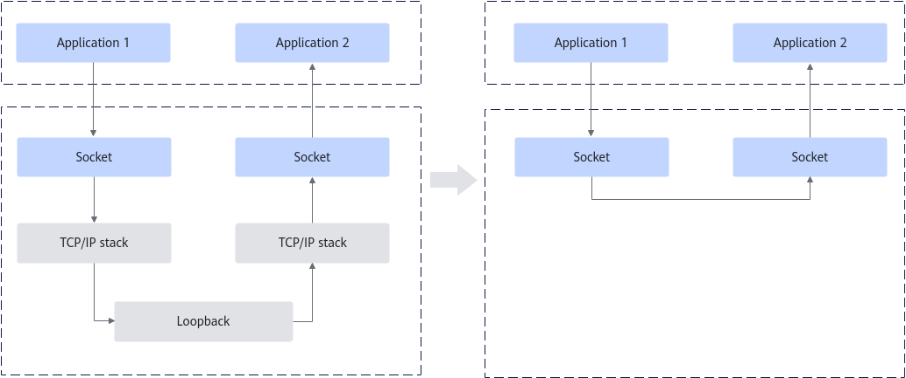
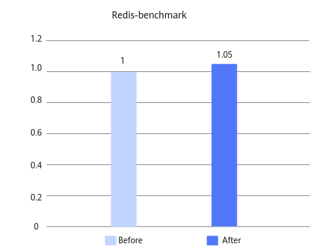

# Redis Sockmap Optimization Feature Guide

## Feature Description<a name="EN-US_TOPIC_0000002542599151"></a>

### Overview<a name="EN-US_TOPIC_0000002511119610"></a>

This document describes how to deploy and enable the Redis sockmap optimization feature and test its performance on the openEuler OS running on the new Kunpeng 920 processor model.

Sockmap is a type of BPF maps storing sock structure information. Using the bpf\_sk\_redirect\_map helper function of the kernel socket object, it enables direct packet (sock buffer) forwarding between sockets, implementing zero-copy data transfer. In local loopback TCP scenarios, sockmap redirects packets at the socket level, bypassing the full TCP/IP stack processing. This significantly reduces the CPU and memory overhead. Therefore, in the Redis localhost access scenario, sockmap can significantly reduce the network protocol stack overhead and improve the performance.

### Principles<a name="EN-US_TOPIC_0000002542638719"></a>

The Redis sockmap optimization feature stores the communication socket objects into the BPF map (sockmap), uses the BPF program to capture data packets, and then redirects the data packets to the target socket, thus bypassing the TCP/IP stack.

- Before sockmap is used, loopback TCP communication may encounter performance bottlenecks.

    Although TCP flows on the same host are topologically in local loopback, data packets still need to traverse the complete TCP/IP stack (including protocol parsing, traffic scheduling, and congestion control) in the traditional network stack model. This results in performance bottlenecks in latency-sensitive cache services.

- After sockmap is used, zero-copy data transfer that bypasses the protocol stack is available.

    With sockmap, the write request of application 1 can be directly redirected to the receiving queue of application 2, bypassing the three-way handshake, congestion control, and traffic scheduling of the TCP/IP stack. This process compresses the complex network-layer data path into a zero-copy memory operation.

    The BPF program directly redirects data packets at the socket layer, bypassing the TCP/IP stack to improve application performance.

[**Figure 1**](#sockmap-principle) shows the implementation principle.

**Figure 1** Sockmap principle<a name="fig19692067534"></a><a id="sockmap-principle"></a><br>


### Constraints<a name="EN-US_TOPIC_0000002543634373"></a>

When sockmap is used to redirect redis-server network traffic, the network policies of the system may be affected.

- Access control failure: If iptables is used to implement access control (for example, only specific containers are allowed to access Redis), sockmap may bypass these rules, making the security policies invalid. In this case, you need to implement the access control in the eBPF programs to replace the iptables policies.
- Restricted network monitoring: Since sockmap bypasses the traditional network stack, Netfilter-based network monitoring tools (such as the tcpdump tool and the iptables log tool) cannot capture or record related traffic information completely, thus affecting traffic audit and troubleshooting efficiency.


## Environment Requirements<a name="EN-US_TOPIC_0000002511138754"></a>

This document provides guidance based on specific environments. Before performing operations, ensure that your hardware and software meet the requirements.

**Table 1** Hardware requirement<a id="hardware-requirement"></a>

|Item|Specifications|
|--|--|
|CPU|New Kunpeng 920 processor model or Kunpeng 950 processor|


**Table 2** OS and software requirements<a id="os-and-software-requirements"></a>

|Item|Version|Version|
|--|--|--|
|OS|openEuler 22.03 LTS SP4: [Link](https://repo.huaweicloud.com/openeuler/openEuler-22.03-LTS-SP4/ISO/aarch64/openEuler-22.03-LTS-SP4-everything-aarch64-dvd.iso)|openEuler 24.03 LTS SP3: [Link](https://repo.huaweicloud.com/openeuler/openEuler-24.03-LTS-SP3/ISO/aarch64/openEuler-24.03-LTS-SP3-everything-aarch64-dvd.iso)|
|Kernel|kernel-5.10.0-216.0.0.115.oe2203sp4: [Link](https://repo.openeuler.org/openEuler-22.03-LTS-SP4/source/Packages/kernel-5.10.0-216.0.0.115.oe2203sp4.src.rpm)|kernel-6.6.0-132.0.0.111.oe2403sp3: [Link](https://dl-cdn.openeuler.openatom.cn/openEuler-24.03-LTS-SP3/source/Packages/kernel-6.6.0-132.0.0.111.oe2403sp3.src.rpm)|


## Feature Installation and Enablement<a name="EN-US_TOPIC_0000002542739059"></a>

The following uses openEuler 22.03 LTS SP4 and kernel-5.10.0-216.0.0.115.oe2203sp4 as an example to describe how to install and enable the sockmap optimization feature. The procedure is as follows:

1. Install sockmap dependencies.

    ```
    dnf install -y rpm-build gcc make flex bison openssl-devel elfutils-libelf-devel bc dwarves python3-docutils python3-devel xmlto kmod patch elfutils elfutils-devel elfutils-libelf-devel llvm llvm-devel clang clang-devel
    ```

2. Go to the working directory, for example, `/home`, and download the kernel source code RPM package.

    ```
    cd /home
    wget --no-check-certificate https://repo.openeuler.org/openEuler-22.03-LTS-SP4/source/Packages/kernel-5.10.0-216.0.0.115.oe2203sp4.src.rpm
    ```

3. Run the following command to install the RPM package.

    ```
    rpm -ivh /home/kernel-5.10.0-216.0.0.115.oe2203sp4.src.rpm
    ```

4. Install dependencies for kernel compilation.

    ```
    dnf install -y OpenCSD audit-libs-devel binutils-devel gtk2-devel java-1.8.0-openjdk java-1.8.0-openjdk-devel\
        java-devel libbabeltrace-devel libcap-devel libcap-ng-devel libpfm-devel libtraceevent-devel libunwind-devel\
        newt-devel numactl-devel pciutils-devel
    ```

5. Go to the `SPEC` file directory and decompress the kernel source code.

    ```
    cd /root/rpmbuild/SPECS
    rpmbuild -bp --target=aarch64 kernel.spec
    ```

    > **NOTE:**
    >rpmbuild is a tool used to build RPM packages on Linux. The `-bp` parameter indicates to execute only the preparation phase, that is, extract the source archive.

6. Compile and install libbpf and bpftool.

    ```
    cd /root/rpmbuild/BUILD/kernel-5.10.0/linux-5.10.0-216.0.0.115.aarch64-source/tools/lib/bpf
    make install 
    cd /root/rpmbuild/BUILD/kernel-5.10.0/linux-5.10.0-216.0.0.115.aarch64-source/tools/bpf/bpftool
    make install
    ```

7. Go to the netacc source code directory.

    ```
    cd /root/rpmbuild/BUILD/kernel-5.10.0/linux-5.10.0-216.0.0.115.aarch64-source/tools/netacc
    ```

    The directory contains the eBPF program examples, which implement the following functions:

    - The netacc_sockops program captures TCP connection setup and disconnection, and stores sockets in sockmap.
    - The netacc_redir program redirects socket messages.
    - The eBPF programs are automatically loaded and attached to the specified cgroup.

    > **NOTICE:**
    >-   The Linux kernel prohibits direct sockmap operation in the user space. You need to write eBPF programs and attach them to kernel hooks such as sockops and sk_msg. eBPF runs in the kernel space and features privileged access. It uses the BPF verifier mechanism to ensure execution security.
    >-   The current example contains the following preset rules. Before production deployment, evaluate and adjust the rules based on the actual application scenario.
    >    -   By default, the SSH port (22) is excluded. You can adjust the port filtering logic in the bpf\_sockmap\_ipv4\_insert\(\) function.
    >    -   By default, only the redis-server process is accelerated. You can extend the list of supported processes in the update\_netacc\_info\(\) function.
    >    -   Currently, only IPv4 is supported. To support IPv6, you can add IPv6 processing functions, extend the socket key-value structure, and update the mapping and search logic.

8. Compile netacc.

    ```
    make
    ```

    

9. Mount cgroup2 for sockmap resource management.

    ```
    mkdir -p /mnt/cgroup2/
    mount -t cgroup2 none /mnt/cgroup2/
    ```

10. Enable netacc to activate the sockmap optimization feature.

    ```
    cd /root/rpmbuild/BUILD/kernel-5.10.0/linux-5.10.0-216.0.0.115.aarch64-source/tools/netacc
    ./netacc enable /mnt/cgroup2/
    ```

11. Use bpftool to check whether the sockmap feature is enabled. If the command output contains content related to `netaccsock_map`, the sockmap feature is enabled.

    ```
    bpftool map show
    ```

    

12. (Optional) Perform the redis-benchmark test to measure the performance improvement when the feature is enabled. For details about the test procedure, see [Redis-benchmark Test Guide](https://www.hikunpeng.com/document/detail/en/kunpengdbs/testguide/tstg/kunpengredis-benchmark_02_0001.html). The sockmap optimization feature can improve the overall redis-benchmark performance (SET and GET) by more than 5% in non-pipeline scenarios with a configuration of 2 vCPUs and 8 GB memory. [**Figure 2**](#performance-comparison-before-and-after-the-sockmap-optimization-feature-is-used) shows the performance comparison before and after the optimization.

    **Figure 2** Performance comparison before and after the sockmap optimization feature is used<a name="fig1425555114118"></a><a id="performance-comparison-before-and-after-the-sockmap-optimization-feature-is-used"></a><br>
    

13. (Optional) Run the following commands to disable the sockmap optimization feature.

    ```
    cd /root/rpmbuild/BUILD/kernel-5.10.0/linux-5.10.0-216.0.0.115.aarch64-source/tools/netacc
    ./netacc disable /mnt/cgroup2/
    ```

## Security Check and Hardening<a name="EN-US_TOPIC_0000002543852539"></a>

Address space layout randomization (ASLR) is a security technology against buffer overflow. It randomizes the layout of linear areas such as heap, stack, and shared library mapping to make it difficult for attackers to predict target addresses and directly locate code, thereby preventing overflow attacks.

```
echo 2 >/proc/sys/kernel/randomize_va_space
```


## Change History<a name="EN-US_TOPIC_0000002511328140"></a>

|Date|Description|
|--|--|
|2026-03-30|The issue is the first official release.|
