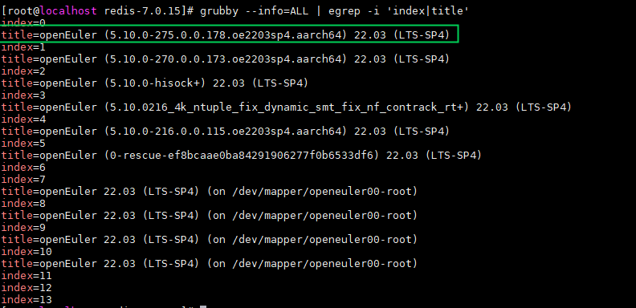
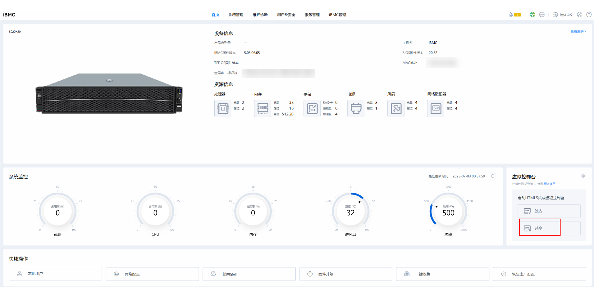
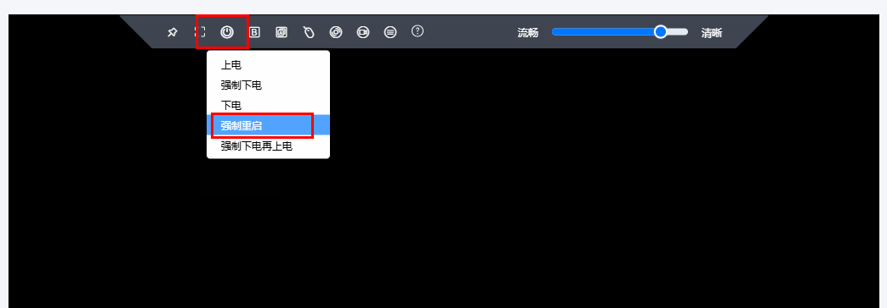
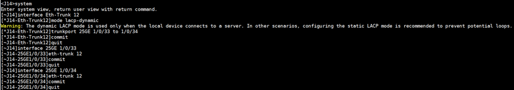
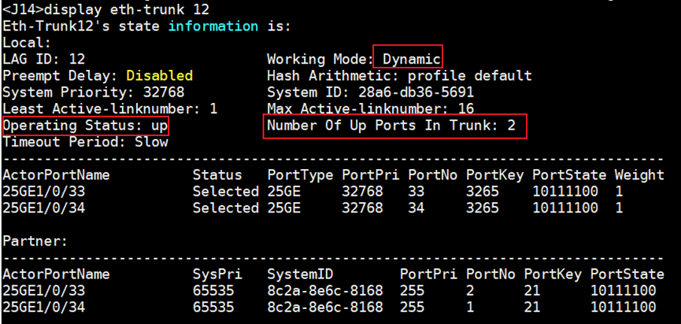
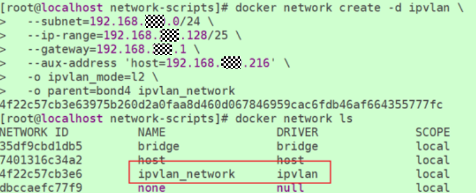
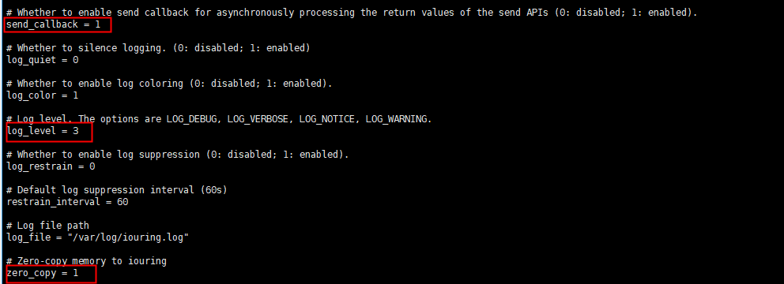
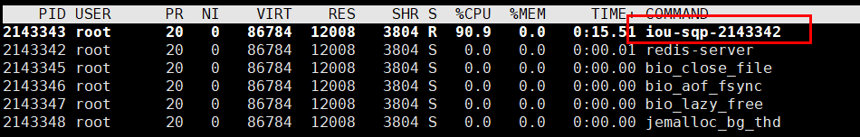

# Redis网络异步优化 特性指南<a name="ZH-CN_TOPIC_0000002521339826"></a>

## 特性描述<a name="ZH-CN_TOPIC_0000002518399378"></a>

本文主要介绍如何在使用openEuler操作系统的鲲鹏920系列处理器上使能Redis网络异步优化特性及其性能测试方法。

KRAIO（Kunpeng Redis  Asynchronous I/O）是鲲鹏自研的批量异步IO算法，Redis网络异步化通过将Redis中网络IO操作交由KRAIO异步批量执行，减少系统调用和上下文切换，实现Redis业务无阻塞执行，从而提高Redis吞吐量。通过配置sqpoll模式，KRAIO启用一个内核线程，自动处理网络IO事件，实现无需系统调用完成IO操作。

Redis网络异步优化特性以Patch文件和kraio库的形式，将KRAIO算法接入开源的Redis数据库中，并配置KRAIO亲和内核，使用新的批量异步IO算法。

## 搭建环境和组网<a name="ZH-CN_TOPIC_0000002549759227"></a>

### 环境要求<a name="ZH-CN_TOPIC_0000002518239452"></a>

本文基于鲲鹏服务器和openEuler操作系统提供指导，在正式操作前请确保软硬件均满足要求。

**表 1** 硬件要求<a id="硬件要求"></a>

|项目|规格|
|--|--|
|CPU|鲲鹏920系列处理器|
|网卡|25GE网卡*2|


**表 2** 操作系统和软件要求<a id="操作系统和软件要求"></a>

|项目|版本|获取地址|
|--|--|--|
|操作系统|openEuler 22.03 LTS SP4|[获取链接](https://www.openeuler.org/zh/download/archive/detail/?version=openEuler%252022.03%2520LTS%2520SP4)|
|容器|openEuler-docker.aarch64.tar.xz|[获取链接](https://dl-cdn.openeuler.openatom.cn/openEuler-22.03-LTS-SP4/docker_img/aarch64/openEuler-docker.aarch64.tar.xz)|
|Redis|6.0.20|[获取链接](https://download.redis.io/releases/redis-6.0.20.tar.gz)|
|Redis|7.0.15|[获取链接](https://download.redis.io/releases/redis-7.0.15.tar.gz)|
|KRAIO亲和内核|kernel-5.10.0-275.0.0.178.oe2203sp4.aarch64.rpm及以上版本|单击[获取链接](https://repo.openeuler.org/openEuler-22.03-LTS-SP4/update/aarch64/Packages/)，在页面中搜索“kernel-5.10.0”，请在搜索结果中选择最新的内核版本进行下载。<br>内核文件名如kernel-5.10.0-xxx.0.0.xxx.oe2203sp4.aarch64.rpm所示，其中xxx越大，代表版本越新。|
|KRAIO patch|redis-6.0.20-adapt-iouring.patch|只适配Redis 6.0.20。<br>[获取链接](https://gitcode.com/boostkit/Redis/blob/master/redis-6.0.20-adapt-iouring.patch)|
|KRAIO patch|redis-7.0.15-adapt-iouring.patch|只适配Redis 7.0.15。<br>[获取链接](https://gitcode.com/boostkit/Redis/blob/master/redis-7.0.15-adapt-iouring.patch)|
|KRAIO库|libkraio.so和kraio.h|适配Redis 7.0.15和Redis 6.0.20。<br>[获取链接](https://gitcode.com/boostkit/Redis/releases/download/BoostDB_Redis_1130/kraio.zip)|


> **说明：** 
>-   本文档基于“Docker+Bond4+IPVLAN”的组网环境进行Redis性能优化验证。
>-   本文档以Redis 7.0.15为例，提供网络异步优化特性的安装、使能、功能测试、性能测试的使用指导。Redis 6.0.20可参照执行，请注意替换命令中的版本号即可。
>-   如果OS环境为openEuler内核，要求内核版本为kernel-5.10.0-275.0.0.178及以上。如果不满足则需要针对性适配亲和性、定时器唤醒等特性和bugfix patch。
>-   如果OS环境为非openEuler内核，要求内核版本为5.10及以上，且需要针对性适配亲和性、定时器唤醒等特性和bugfix patch。

### 替换亲和内核<a name="ZH-CN_TOPIC_0000002549759231"></a>

网络异步优化特性需要依赖指定的内核版本，因此需要提前安装具有网络异步优化特性的OS内核。安装完内核后可通过操作系统的GRUB工具更改内核默认启动项，或通过iBMC远程管理接口选择内核来替换内核，两种方式自行选择一种即可。

**使用命令行方式替换<a name="section9307191317373"></a>**

1. 请参见[**表 2** 操作系统和软件要求](#操作系统和软件要求)下载KRAIO亲和内核rpm包放到环境上，在亲和内核所在目录下执行以下命令进行安装。

    ```
    rpm -ivh kernel-5.10.0-275.0.0.178.oe2203sp4.aarch64.rpm --force
    ```

2. 检查已经安装的内核，找出KRAIO亲和内核的索引号，假设索引号为0。

    ```
    grubby --info=ALL | egrep -i 'index|title'
    ```

3. 使用KRAIO亲和内核的索引号“0”替换默认内核引导条目。

    ```
    grubby --set-default-index=0
    ```

4. 查看默认内核，确认已替换成KRAIO亲和内核。

    ```
    grubby --default-kernel 
    ```

    

5. 重启服务器。

    ```
    reboot
    ```

**使用iBMC方式替换<a name="section1987503243710"></a>**

1. 将KRAIO亲和内核下载到环境上，在亲和内核所在目录下执行以下命令进行安装。

    ```
    rpm -ivh kernel-5.10.0-275.0.0.178.oe2203sp4.aarch64.rpm --force
    ```

2. 进入服务器管理平台iBMC。

    

3. 进入虚拟控制台。

    

4. 强制重启。

    

5. 选择KRAIO亲和内核后等待重启完成。

    


### （可选）配置Bond4<a name="ZH-CN_TOPIC_0000002518239448"></a>

如果需要搭建“Docker+Bond4+IPVLAN”的组网环境，请参考本章节配置Bond4，否则跳过本章节。

Bond4是网络接口绑定（Network Interface Bonding）中的模式4，也称为IEEE 802.3ad动态链路聚合或LACP（Link Aggregation Control Protocol，链路聚合控制协议）。这种模式通过将多个物理网络接口组合成一个逻辑接口来提升带宽和提供冗余。

配置Bond4需要修改Server端配置以及交换机配置，需要提前知道Server端组Bond4的两张网卡对应交换机上的物理接口以及交换机IP地址。

**交换机动态LACP配置<a name="section673713294454"></a>**

1. 登录交换机。
2. 查看交换机上所有可用的物理接口。

    ```
    display interface brief
    ```

    

    > **说明：** 
    >如上图所示，检查Server端组Bond4的两张网卡eth1和eth2对应交换机上的端口状态为**up**且没有在Eth-Trunk组内。下文以25GE 1/0/33和25GE 1/0/34端口为例进行Bond4配置。

3. 创建聚合组Eth-Trunk 12，并将物理接口25GE 1/0/33和25GE 1/0/34加入Eth-Trunk 12。

    ```
    system-view 
    interface Eth-Trunk 12 
    mode lacp-dynamic 
    trunkport 25GE 1/0/33 
    trunkport 25GE 1/0/34 
    commit 
    quit 
      
    interface 25GE 1/0/33 
    eth-trunk 12 
    commit 
    quit 
      
    interface 25GE 1/0/34 
    eth-trunk 12 
    commit 
    quit
    ```

    

**Server端配置<a name="section10576182552614"></a>**

登录Server端，执行以下操作将两张网卡eth1和eth2组成Bond4。

1. 登录Server端。
2. 断开eth1和eth2网卡的网络连接。

    ```
    nmcli con down eth1 
    nmcli con down eth2
    ```

3. 备份eth1网卡和eth2网卡配置文件“/etc/sysconfig/network-scripts/ifcfg-eth1”和“/etc/sysconfig/network-scripts/ifcfg-eth2”，并删除原文件。

    ```
    cd /etc/sysconfig/network-scripts 
    cp ifcfg-eth1 ifcfg-eth1.bak 
    cp ifcfg-eth2 ifcfg-eth2.bak
    rm -rf ifcfg-eth1
    rm -rf ifcfg-eth2
    ```

4. 将eth1和eth2网卡组成Bond4，且使其支持802.3ad协议。

    ```
    nmcli con add type bond con-name bond4 ifname bond4 mode 802.3ad 
    nmcli con add type bond-slave ifname eth1 master bond4 
    nmcli con add type bond-slave ifname eth2 master bond4 
    nmcli con up bond-slave-eth1 
    nmcli con up bond-slave-eth2 
    nmcli con up bond4
    ```

5. 修改Bond4的配置文件。

    ```
    vi /etc/sysconfig/network-scripts/ifcfg-bond4
    ```

    添加IP地址，将“BOOTPROTO=dhcp”改成“BOOTPROTO=none”。

    ```
    IPADDR=192.168.xx.xx 
    NETMASK=255.255.255.0 
    BOOTPROTO=none
    ```

    

6. 重启网络服务和Bond4 。

    ```
    service NetworkManager restart 
    nmcli con down bond4 
    nmcli con up bond4
    ```

7. 查看Bond4的网络信息。

    ```
    ip a | grep -C 5 bond4  
    ip a
    ```

    

8. 查看Bond4状态。

    ```
    cat /proc/net/bonding/bond4
    ```

    

    满足以下条件则Bond4配置正确：

    - Bonding Mode为IEEE 802.3ad Dynamic link aggregation。
    - MII Status状态为up。
    - 服务器间使用Bond4的IP地址，网络可正常连接。

**交换机侧检查Bond4配置<a name="section143079151714"></a>**

在Server端配置完成Bond4并检查配置正确后，在交换机侧查看Eth-Trunk 12。

```
display eth-trunk 12
```



满足以下条件则表示Bond4配置正确：

- Working Mode为**Dynamic**。
- Operating Status状态为**up**。
- Number Of Up Ports In Trunk为**2**，且在回显中有25GE 1/0/33和25GE 1/0/34两个端口的相关信息。

### （可选）创建IPVLAN网络<a name="ZH-CN_TOPIC_0000002549759229" id="（可选）创建IPVLAN网络"></a>

如果需要搭建“Docker+Bond4+IPVLAN”的组网环境，请参考本章节创建IPVLAN网络，否则跳过本章节。

IPVLAN是一种Linux网络设备驱动，它提供了一种轻量级的方式来创建多个逻辑网络接口，这些接口共享同一个物理网络接口。这种方式有助于减少在大型部署中的MAC地址冲突问题，并且由于减少了交换机上的MAC表项，也能降低对交换机资源的消耗。

**常用命令<a name="title343mcpsimp"></a>**

- 查看Docker版本。

    ```
    docker --version
    ```

- 加载镜像。

    ```
    docker load -i openEuler-docker.aarch64.tar.xz
    ```

- 查看加载的镜像。

    ```
    docker images
    ```

    

- 显示正在运行的Docker容器。

    ```
    docker ps
    ```

- 显示所有Docker容器，包括已经停止的容器。

    ```
    docker ps -a
    ```

- 停止容器。

    ```
    docker stop <容器id>
    ```

- 删除容器。

    ```
    docker rm  (-f) <容器id>
    ```

- 查看容器网络。

    ```
    docker network ls
    ```

    

**创建Docker IPVLAN网络<a name="title363mcpsimp"></a>**

1. 查看内核加载的模块中是否包含IPVLAN模块。

    ```
    lsmod | grep ipvlan
    ```

    若没有回显信息，加载IPVLAN内核模块。

    ```
    sudo modprobe ipvlan
    ```

2. 环境重启后若Docker服务未启动，需重启Docker服务，否则跳过该步骤。

    ```
    sudo systemctl restart docker
    ```

3. 创建Docker IPVLAN网络，配置命令参考如下，请按实际情况修改对应参数，详见[**表 1** 参数说明](#参数说明)。

    ```
    docker network create -d ipvlan \
     --subnet=192.168.***.0/24 \
     --ip-range=192.168.***.128/25 \
     --gateway=192.168.***.1 \
     -o ipvlan_mode=l2 \
     -o parent=bond4 ipvlan_network
    ```

    > **说明：** 
    >该操作每次环境重启都需要重新配置。

    **表 1** 参数说明<a id="参数说明"></a>

|参数|说明|取值|
|--|--|--|
|subnet|子网|改为环境网段，根据机器网段配置，与配置网卡IP地址的网段保持一致。|
|ip-range|Docker分配给容器的IP地址范围|如上述举例所示，表示Docker容器的起始IP地址从192.168.\*\*\*.128开始。如果本行删除，则表示Docker容器的起始IP地址默认从192.168.\*\*\*.2开始。|
|gateway|网关|改为环境网段，根据机器网段配置，与配置网卡IP地址的网段保持一致。|
|ipvlan_mode|IPVLAN模式|l2|
|parent|设置作为父接口的网络设备名称。通常是一个聚合了多个物理网卡的逻辑接口。|parent设为网络设备名称，可为bond4网卡也可为单张网卡，如enp24s0f0np0 ipvlan_network。网络名称是ipvlan_network。|


   
   

### （可选）创建Docker容器<a name="ZH-CN_TOPIC_0000002549879223"></a>

如果需要搭建Docker的组网环境，请参考本章节创建Docker容器，否则跳过本章节。

本文档基于“Docker+Bond4+IPVLAN”组网环境四实例进行测试验证，请执行以下命令创建4个Docker容器。其中，Docker容器规格是2U10G，每个NUMA上创建一个Docker容器。如果基于其他实例个数，请根据实际情况创建对应Docker容器数量。

1. 安装Docker，请参见《[Docker安装指南](https://www.hikunpeng.com/document/detail/zh/kunpengcpfs/ecosystemEnable/Docker/kunpengdocker_03_0001.html)》。
2. 创建Docker容器。

    ```
    docker run --cpus=2 --cpuset-cpus=0-79 --cpuset-mems=0 -m 10g --net=ipvlan_network --cap-add CAP_SYS_ADMIN \ 
    --privileged=true -itd --name redis-docker-ipvlan-numa0-1 \ 
    -v /home:/home -v /usr:/usr -v /mnt:/mnt -v /lib/modules:/lib/modules -v /data:/data -v /etc:/etc \ 
    openeuler-22.03-lts-sp4 /bin/bash 
      
    docker run --cpus=2 --cpuset-cpus=80-159 --cpuset-mems=1 -m 10g --net=ipvlan_network --cap-add CAP_SYS_ADMIN \ 
    --privileged=true -itd --name redis-docker-ipvlan-numa1-1 \ 
    -v /home:/home -v /usr:/usr -v /mnt:/mnt -v /lib/modules:/lib/modules -v /data:/data -v /etc:/etc \ 
    openeuler-22.03-lts-sp4 /bin/bash 
      
    docker run --cpus=2 --cpuset-cpus=160-239 --cpuset-mems=2 -m 10g --net=ipvlan_network --cap-add CAP_SYS_ADMIN \ 
    --privileged=true -itd --name redis-docker-ipvlan-numa2-1 \ 
    -v /home:/home -v /usr:/usr -v /mnt:/mnt -v /lib/modules:/lib/modules -v /data:/data -v /etc:/etc \ 
    openeuler-22.03-lts-sp4 /bin/bash 
      
    docker run --cpus=2 --cpuset-cpus=240-319 --cpuset-mems=3 -m 10g --net=ipvlan_network --cap-add CAP_SYS_ADMIN \ 
    --privileged=true -itd --name redis-docker-ipvlan-numa3-1 \ 
    -v /home:/home -v /usr:/usr -v /mnt:/mnt -v /lib/modules:/lib/modules -v /data:/data -v /etc:/etc \ 
    openeuler-22.03-lts-sp4 /bin/bash
    ```

    > **说明：** 
    >容器创建参数说明。
    >-   **cpus**：容器使用的CPU核数，本文指定2核进行测试。
    >-   **cpuset-cpus**：每个NUMA上的核数范围，如本文测试机器每个NUMA是80个核，在每个NUMA上创建一个Redis实例。
    >-   **cpuset-mems**：容器运行内存所处的NUMA，本文指定运行内存跟CPU所运行的NUMA一致。
    >-   **m**：容器使用的内存大小，本文指定为10GB。
    >-   **net**：容器网络类型，本文指定为ipvlan\_network下执行，可参见[（可选）创建IPVLAN网络](#（可选）创建IPVLAN网络)。如果组网环境不是IPVLAN，请根据实际情况修改。


## 编译和使能特性<a name="ZH-CN_TOPIC_0000002518239458"></a>

在Redis上使能网络异步优化特性需要先安装相关依赖库再执行so文件编译与patch包合入。本节以Redis 7.0.15使能特性为例进行说明。

1. 下载所需依赖。

    ```
    yum -y install wget git vim tar make gcc gcc-c++ libatomic texinfo libtool
    ```

2. 安装liburing.a依赖库。

    ```
    git clone https://gitee.com/src-openeuler/liburing.git
    cd liburing
    tar -zxvf liburing-2.4.tar.gz
    cd liburing-2.4
    make -j
    make install
    ```

3. 安装libconfig依赖库。

    ```
    git clone https://gitee.com/src-openeuler/libconfig.git
    cd libconfig
    tar -zxvf v1.8.1.tar.gz
    cd libconfig-1.8.1
    autoreconf --install --force
    ./configure --prefix=/usr/local
    make -j
    make install
    cp /usr/local/lib/libconfig.so.15 /usr/lib64
    ```

4. 请参见[**表 2** 操作系统和软件要求](#操作系统和软件要求)下载Redis 7.0.15配套网络异步优化特性patch包。
5. 下载[kraio库](https://gitcode.com/boostkit/Redis/releases/download/BoostDB_Redis_1130/kraio.zip)并解压。
6. 新建“/etc/kraio”文件夹，将kraio中的kraio.conf文件复制到“/etc/kraio”中。

    ```
    cd kraio
    mkdir /etc/kraio 
    cp conf/kraio.conf /etc/kraio
    ```

7. 将下载的so文件和kraio.h文件放到对应路径，并配置环境变量。

    ```
    cp ./libkraio/libkraio.so /usr/lib64 
    cp ./include/kraio.h /usr/include
    export PATH=/usr/local/include:$PATH 
    export LD_LIBRARY_PATH=$LD_LIBRARY_PATH:/usr/lib64:/usr/lib
    ```

8. 将Redis中的**redis-7.0.15-adapt-iouring.patch**移到Redis源码目录下，执行合入patch的命令。

    > **说明：** 
    >此处以Redis 7.0.15为例。对于Redis 6.0.20，请将**redis-6.0.20-adapt-iouring.patch**移到Redis源码目录下，再执行合入patch的命令。后续操作中，请注意替换命令中的版本号。

    ```
    git clone https://gitcode.com/BoostKit/Redis.git
    cd Redis
    cp redis-7.0.15-adapt-iouring.patch path/redis-7.0.15/
    cd path/redis-7.0.15
    patch -p1 < redis-7.0.15-adapt-iouring.patch
    ```

9. 重新编译Redis。

    ```
    cd path/redis-7.0.15
    make distclean
    make -j
    ```

10. 修改“/etc/kraio/kraio.conf”文件。
    1. 进入/etc/kraio。

        ```
        cd /etc/kraio
        ```

    2. 打开kraio.conf。

        ```
        vim kraio.conf
        ```

    3. 按“i”进入编辑模式，修改send\_callback=1, zero\_copy=1和log\_level=3。

        

    4. 按“Esc”键，输入 **:wq!**，按“Enter”保存并退出编辑。

11. 在测试过程中，在服务器端输入如下命令查看，如出现iou-sqp-\*相关线程说明特性使能成功。

    ```
    top -Hp <redis-server实例pid>
    ```

    

## 验证特性<a name="ZH-CN_TOPIC_0000002549759225"></a>

### 测试功能（单机模式）<a name="ZH-CN_TOPIC_0000002549879225"></a>

1. 在Server端环境分别进入4个Docker容器，每个Docker容器上启动一个网络异步优化后的redis-server实例，共启动4个网络异步优化后的redis-server实例。

    ```
    docker exec -it {容器名} bash 
    ```

    - 对于Redis 6.0.20版本：

        ```
        cd path/redis-6.0.20
        ./src/redis-server ./redis.conf --bind 0.0.0.0 --port 6379
        ```

    - 对于Redis 7.0.15版本：

        ```
        cd path/redis-7.0.15
        ./src/redis-server ./redis.conf --bind 0.0.0.0 --port 6379
        ```

2. 在Client端环境进入Redis目录，准备压力测试脚本，可参考以下脚本内容并按实际情况修改相应参数。

    > **说明：** 
    >Client端可以和Server端在同一个机器，但性能会受影响；建议进行远端压力测试，在远端机器安装标准版Redis 6.0.20进行测试，安装可参见《[Redis移植指南](https://www.hikunpeng.com/document/detail/zh/kunpengdbs/ecosystemEnable/Redis/kunpengredis_02_0001.html)》。
    >以下参数请按实际情况进行修改：
    >-   REDIS\_SERVER\_IP\_PREFIX为IP地址网段。
    >-   redis\_server\_ip\_suffix为起始IP地址后缀。
    >-   instances为实例数，这里为4。
    >-   client为-c参数，设为最优并发数，默认200，也可改成其他。
    >-   size为-d参数，默认3字节，也可改为256字节或其他。

    ```
    #!/bin/bash 
     
    REDIS_PATH="xxx1" # Redis所在目录
    REDIS_PORT=6379 
    REDIS_SERVER_IP_PREFIX="192.168.xx" 
    redis_server_ip_suffix=128 # server端起始IP地址后缀 
    instances=4 # 实例数 
    client=200 #-c参数 
    size=3  # -d参数，默认3 
     
    # 关闭redis-benchmark进程，清空测试数据日志 
    pkill redis-benchmark 
    DATA_LOG="xxx2" # 性能数据结果存放目录
    mkdir -p $DATA_LOG 
    rm -rf ${DATA_LOG}/* 
     
    # 在Client端进行redis-benchmark压测 
    job_ids="" 
    for (( instance=1; instance<=instances; instance++ )); do 
        REDIS_SERVER_IP="${REDIS_SERVER_IP_PREFIX}.${redis_server_ip_suffix}" 
        echo "Running redis-benchmark on ${REDIS_SERVER_IP}:$REDIS_PORT" 
        echo "${REDIS_PATH}/src/redis-benchmark -h ${REDIS_SERVER_IP} -p $REDIS_PORT" 
        ${REDIS_PATH}/src/redis-benchmark -h ${REDIS_SERVER_IP} -p $REDIS_PORT -c $client -d $size -n 10000000 -r 10000000 -t set,get --threads 20 -q >> ${DATA_LOG}/${instances}_c${client}_d${size}_${REDIS_SERVER_IP}_${REDIS_PORT}.log & 
        job_ids="$job_ids $!" 
        ((redis_server_ip_suffix++)) 
    done 
     
    # 等待 redis-benchmark 执行完毕 
    echo "Waiting for the $instances jobs: SET, GET" 
    wait $job_ids
    ```

3. 执行压测脚本同时对四个实例进行redis-benchmark压测。

    性能结果会记录在规定路径DATA\_LOG下，用`cat ./*`查看，取四个实例的平均值为四实例性能。

    若测试正常完成无报错则功能验证成功。


### 测试功能（主备复制模式）<a name="ZH-CN_TOPIC_0000002549879229"></a>

1. 在Server端环境启动1个Docker容器，按照《[Redis部署指南](https://www.hikunpeng.com/document/detail/zh/kunpengdbs/ecosystemEnable/Redis/kunpengredis_04_0001.html)》中主从复制模式部署的方式部署。
2. 客户端启动redis\_benchmark进行测试，命令中的`$HOST`需改为服务端的IP地址，`$PORT`改成主Redis的端口号，redis-benchmark替换为实际路径。

    ```
    redis-path/src/redis-benchmark -h $HOST -p $PORT -c 200 -n 10000000 -r 10000000 -t set,get --threads 20
    ```

    若测试正常完成无报错，主Redis无异常退出则功能验证成功。


### 测试性能<a name="ZH-CN_TOPIC_0000002549879221"></a>

1. 在Server端执行以下命令进行基础环境配置。

    ```
    systemctl stop firewalld.service
    systemctl disable firewalld.service
    sed -i 's/SELINUX=enforcing/SELINUX=disabled/g' /etc/sysconfig/selinux
    setenforce 0
    systemctl stop irqbalance.service
    systemctl disable irqbalance.service
    swapoff -a
    systemctl start irqbalance
    ```

2. 设置firewalld在退出时清理内核模块。

    ```
    sed -i "s/CleanupModulesOnExit=no/CleanupModulesOnExit=yes/g" /etc/firewalld/*.conf
    ```

3. 重启firewalld服务。

    ```
    systemctl restart firewalld
    ```

4. 停止firewalld服务。

    ```
    systemctl stop firewalld
    ```

5. <a name="li324mcpsimp"></a>在Server端环境分别进入4个Docker容器，每个Docker容器上启动一个网络异步优化后的redis-server实例，共启动4个网络异步优化后的redis-server实例。

    > **说明：** 
    >对于Redis 6.0.20，请将步骤[5](#li324mcpsimp)命令中的目录替换成Redis 6.0.20的目录即可，其它操作步骤与Redis 7.0.15一致。

    ```
    docker exec -it {容器名} bash 
    cd path/redis-7.0.15 
    ./src/redis-server ./redis.conf --bind 0.0.0.0 --port 6379
    ```

6. 在Client端环境进入Redis目录，准备压测脚本，可参考以下脚本内容并按实际情况修改相应参数。

    > **说明：** 
    >Client端可以和Server端在同机器，但性能会受影响；建议远端压测，在远端机器安装标准版Redis 7.0.15进行测试，安装可参见《[Redis移植指南](https://www.hikunpeng.com/document/detail/zh/kunpengdbs/ecosystemEnable/Redis/kunpengredis_02_0001.html)》。
    >以下参数请按实际情况进行修改：
    >-   REDIS\_SERVER\_IP\_PREFIX为IP地址网段。
    >-   redis\_server\_ip\_suffix为起始IP地址后缀。
    >-   instances=4。
    >-   client为-c参数，设为最优并发数。
    >-   size为-d参数，默认3字节，也可改为256字节或其他。

    ```
    #!/bin/bash 
     
    REDIS_PATH="xxx1" # Redis所在目录
    REDIS_PORT=6379 
    REDIS_SERVER_IP_PREFIX="192.168.xx" 
    redis_server_ip_suffix=128 # server端起始IP地址后缀 
    instances=4 # 实例数 
    client=200 #-c参数 
    size=3  # -d参数，默认3 
     
    # 关闭redis-benchmark进程，清空测试数据日志 
    pkill redis-benchmark 
    DATA_LOG="xxx2" # 性能数据结果存放目录
    mkdir -p $DATA_LOG 
    rm -rf ${DATA_LOG}/* 
     
    # 在Client端进行redis-benchmark压测 
    job_ids="" 
    for (( instance=1; instance<=instances; instance++ )); do 
        REDIS_SERVER_IP="${REDIS_SERVER_IP_PREFIX}.${redis_server_ip_suffix}" 
        echo "Running redis-benchmark on ${REDIS_SERVER_IP}:$REDIS_PORT" 
        echo "${REDIS_PATH}/src/redis-benchmark -h ${REDIS_SERVER_IP} -p $REDIS_PORT" 
        ${REDIS_PATH}/src/redis-benchmark -h ${REDIS_SERVER_IP} -p $REDIS_PORT -c $client -d $size -n 10000000 -r 10000000 -t set,get --threads 20 -q >> ${DATA_LOG}/${instances}_c${client}_d${size}_${REDIS_SERVER_IP}_${REDIS_PORT}.log & 
        job_ids="$job_ids $!" 
        ((redis_server_ip_suffix++)) 
    done 
     
    # 等待 redis-benchmark 执行完毕 
    echo "Waiting for the $instances jobs: SET, GET" 
    wait $job_ids
    ```

7. 执行压测脚本同时对四个实例进行redis-benchmark压测。

    性能结果会记录在规定路径DATA\_LOG下，用`cat ./*`命令查看，取四个实例的平均值为四实例性能。

8. 在所有测试结束后，请参见[（可选）取消Bond4](#ZH-CN_TOPIC_0000002518399380)进行Bond4的取消。


## 维护特性<a name="ZH-CN_TOPIC_0000002518399374"></a>

### （可选）取消Bond4<a name="ZH-CN_TOPIC_0000002518399380"></a>

在所有测试结束后，取消Bond4，恢复环境。

**交换机侧取消Bond4<a name="section527765410133"></a>**

1. 登录交换机。
2. 删除interface eth-trunk 12。

    ```
    system-view 
    interface eth-trunk 12 
    undo trunkport 25GE 1/0/33 
    undo trunkport 25GE 1/0/34 
    commit 
    quit 
      
    undo interface eth-trunk 12 
    commit 
    quit
    ```

**Server端取消Bond4<a name="section1651045721613"></a>**

1. 登录Server端。
2. 停用绑定的连接。

    ```
    nmcli con down bond-slave-eth1 
    nmcli con down bond-slave-eth2 
    nmcli con down bond4
    ```

3. 从Bond中移除物理接口。

    ```
    nmcli con delete bond-slave-eth1 
    nmcli con delete bond-slave-eth2
    ```

4. 删除Bond4连接。

    ```
    nmcli con delete bond4
    ```

5. 恢复备份的eth1网卡和eth2网卡的配置文件。

    ```
    cd /etc/sysconfig/network-scripts 
    mv ifcfg-eth1.bak ifcfg-eth1 
    mv ifcfg-eth2.bak ifcfg-eth2 
    ifup eth1 
    ifup eth2
    ```


## 故障排除<a name="ZH-CN_TOPIC_0000002549759223"></a>

### 执行创建Docker IPVLAN网络命令后提示：plugin "ipvlan" not found的解决方法<a name="ZH-CN_TOPIC_0000002549879227"></a>

**问题现象描述<a name="section642124153116"></a>**

执行创建Docker IPVLAN网络命令后提示：Error response from daemon: plugin "ipvlan" not found。

**关键过程、根本原因分析<a name="section145813300553"></a>**

IPVLAN在Docker中仍然被标记为实验性功能。

**结论、解决方案及效果<a name="section142121051103112"></a>**

1. 打开文件daemon.json。

    ```
    vi /etc/docker/daemon.json
    ```

2. 按“i”进入编辑模式，修改字段（如果文件内已有内容，将以下字段添加至顶部）。

    ```
    { 
       "experimental": true 
    }
    ```

3. 按“Esc”键，输入 **:wq!**，按“Enter”保存并退出编辑。
4. 重启Docker服务。

    ```
    sudo systemctl restart docker
    ```


## FAQ<a name="ZH-CN_TOPIC_0000002518239456"></a>

**表 1** Redis网络异步优化常见问题<a id="Redis网络异步优化常见问题"></a>

|序号|问题|答案|
|--|--|--|
|1|Redis整机多实例（实例数等于CPU个数）高并发场景下开启AOF功能进行测试，Redis日志输出“Asynchronous AOF fsync is taking too long (disk is busy?)”。|根据Redis日志提示，Redis-server服务器的磁盘带宽资源不足，增加磁盘带宽可以解决。|
|2|Redis整机多实例（实例数等于CPU个数）高并发场景下，压测时随着压测端连接数增加，吞吐量减少。|通过htop命令查看系统瓶颈点在网卡队列不足，增加网卡队列或网卡可以解决。|


## 安全检查与加固<a name="ZH-CN_TOPIC_0000002518239450"></a>

ASLR（Address Space Layout Randomization，地址空间布局随机化）是一种针对缓冲区溢出的安全保护技术，通过对堆、栈、共享库映射等线性区布局的随机化，增加攻击者预测目的地址的难度，防止攻击者直接定位攻击代码位置，达到阻止溢出攻击的目的。

```
echo 2 >/proc/sys/kernel/randomize_va_space
```


## 缩略语<a name="ZH-CN_TOPIC_0000002518399382"></a>

|**缩略语**|**英文全称**|**中文全称**|
|--|--|--|
|KRAIO|Kunpeng Redis Asynchronous I/O|鲲鹏批量异步IO算法|
|LACP|Link Aggregation Control Protocol|链路聚合控制协议|
|AE|Asynchronous Event|异步事件|
|ASLR|Address Space Layout Randomization|地址空间布局随机化|


