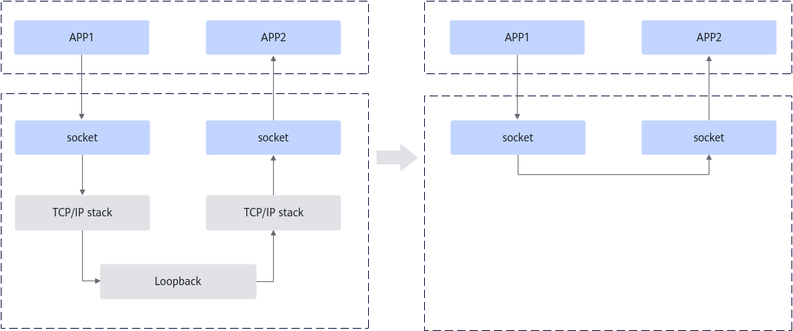
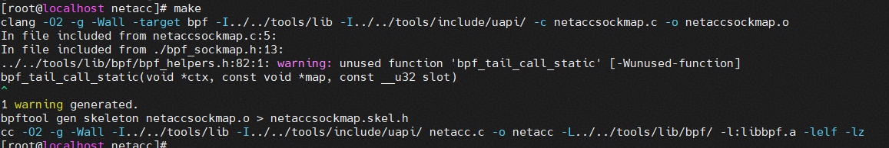
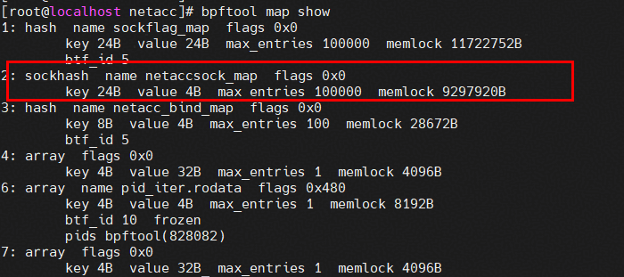
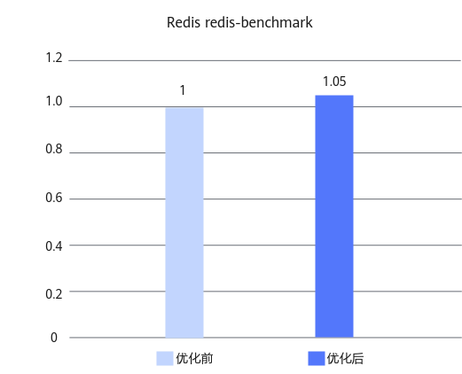

# Redis sockmap优化 特性指南

## 特性描述<a name="ZH-CN_TOPIC_0000002542599151"></a>

### 简介<a name="ZH-CN_TOPIC_0000002511119610"></a>

本文主要介绍如何在使用openEuler操作系统的鲲鹏920新型号处理器上使能Redis sockmap优化特性及其性能测试方法。

sockmap是一种用于存储sock结构体信息的BPF map类型。它通过内核socket对象的重定向（bpf\_sk\_redirect\_map）Helper函数，能够在两个socket之间直接转发数据包（sock buffer），实现数据的“零拷贝”传输。在本机环回（loopback）的TCP流场景下，sockmap可以在socket层面直接将数据包重定向到目标socket，从而绕过（bypass）TCP/IP协议栈的完整处理流程，这种方式显著减少了CPU和内存的开销。因此，在Redis的localhost访问场景中，sockmap能够显著降低网络协议栈的开销，带来显著的性能提升。

### 原理描述<a name="ZH-CN_TOPIC_0000002542638719"></a>

Redis sockmap优化特性通过将参与通信的socket对象存入BPF map（sockmap数据结构），使用BPF程序捕获数据包，直接将其重定向到目标socket，而无需重新进入TCP/IP协议栈。

- 使用sockmap前：传统TCP回环通信存在性能瓶颈

    同一主机内部的TCP流虽然在网络拓扑上属于本地回环（loopback），但在传统网络栈模型下，数据包仍需经历完整的TCP/IP协议栈处理流程（包括协议解析、流量调度、拥塞控制等），这对延迟敏感的缓存服务构成了不可忽视的性能瓶颈。

- 使用sockmap后：绕过协议栈的零拷贝直通

    利用sockmap，可以将APP1的写请求直接重定向到APP2的接收队列，而无需经过TCP/IP协议栈的三次握手、拥塞控制和流量调度等处理环节。这一过程将原本复杂的网络层数据路径，压缩为一个零拷贝的内存操作。

    通过BPF程序直接将数据包在socket层进行重定向，在socket层bypass掉TCP/IP协议栈，以实现应用的性能提升。

具体实现原理如[**图 1** sockmap原理图](#sockmap原理图)所示。

**图 1** sockmap原理图<a name="fig19692067534"></a><a id="sockmap原理图"></a><br>


### 约束与限制<a name="ZH-CN_TOPIC_0000002543634373"></a>

当使用sockmap将redis-server的网络流量重定向时，会对系统的网络策略产生影响。

- 访问控制失效：若原本依赖iptables实现访问控制（例如仅允许特定容器访问Redis），使用sockmap可能会绕过这些规则，从而使安全策略失效。此时，需要在eBPF程序中自行实现访问控制逻辑，以替代传统的iptables策略。
- 网络监控受限：由于sockmap将流量绕过了传统网络栈，使用基于Netfilter的网络监控工具（如tcpdump工具和iptables日志工具）将无法完整捕获和记录相关流量信息，影响流量审计和故障排查的效率。


## 环境要求<a name="ZH-CN_TOPIC_0000002511138754"></a>

本文基于特定环境提供指导，在正式操作前请确保软硬件均满足要求。

**表 1** 硬件要求<a id="硬件要求"></a>

|项目|规格|
|--|--|
|CPU|鲲鹏920新型号处理器、鲲鹏950处理器|


**表 2** 操作系统和软件要求<a id="操作系统和软件要求"></a>

|项目|版本|版本|
|--|--|--|
|OS|openEuler 22.03 LTS SP4：[获取链接](https://repo.huaweicloud.com/openeuler/openEuler-22.03-LTS-SP4/ISO/aarch64/openEuler-22.03-LTS-SP4-everything-aarch64-dvd.iso)|openEuler 24.03 LTS SP3：[获取链接](https://repo.huaweicloud.com/openeuler/openEuler-24.03-LTS-SP3/ISO/aarch64/openEuler-24.03-LTS-SP3-everything-aarch64-dvd.iso)|
|对应内核|kernel-5.10.0-216.0.0.115.oe2203sp4：[获取链接](https://repo.openeuler.org/openEuler-22.03-LTS-SP4/source/Packages/kernel-5.10.0-216.0.0.115.oe2203sp4.src.rpm)|kernel-6.6.0-132.0.0.111.oe2403sp3：[获取链接](https://dl-cdn.openeuler.openatom.cn/openEuler-24.03-LTS-SP3/source/Packages/kernel-6.6.0-132.0.0.111.oe2403sp3.src.rpm)|


## 安装和使能特性<a name="ZH-CN_TOPIC_0000002542739059"></a>

以openEuler 22.03 LTS SP4、kernel-5.10.0-216.0.0.115.oe2203sp4为例介绍如何安装和使能sockmap优化特性，具体操作步骤如下。

1. 安装sockmap相关依赖。

    ```
    dnf install -y rpm-build gcc make flex bison openssl-devel elfutils-libelf-devel bc dwarves python3-docutils python3-devel xmlto kmod patch elfutils elfutils-devel elfutils-libelf-devel llvm llvm-devel clang clang-devel
    ```

2. 进入工作目录例如“/home”，并下载内核源码rpm包。

    ```
    cd /home
    wget --no-check-certificate https://repo.openeuler.org/openEuler-22.03-LTS-SP4/source/Packages/kernel-5.10.0-216.0.0.115.oe2203sp4.src.rpm
    ```

3. 执行如下命令安装rpm包。

    ```
    rpm -ivh /home/kernel-5.10.0-216.0.0.115.oe2203sp4.src.rpm
    ```

4. 安装构建所需依赖。

    ```
    dnf install -y OpenCSD audit-libs-devel binutils-devel gtk2-devel java-1.8.0-openjdk java-1.8.0-openjdk-devel\
        java-devel libbabeltrace-devel libcap-devel libcap-ng-devel libpfm-devel libtraceevent-devel libunwind-devel\
        newt-devel numactl-devel pciutils-devel
    ```

5. 进入SPEC文件目录并解压内核源码。

    ```
    cd /root/rpmbuild/SPECS
    rpmbuild -bp --target=aarch64 kernel.spec
    ```

    > **说明：** 
    >rpmbuild是Linux下用于构建RPM包的工具，-bp参数表示仅执行准备（Prepare）阶段，即解压源码。

6. 编译安装libbpf和bpftool。

    ```
    cd /root/rpmbuild/BUILD/kernel-5.10.0/linux-5.10.0-216.0.0.115.aarch64-source/tools/lib/bpf
    make install 
    cd /root/rpmbuild/BUILD/kernel-5.10.0/linux-5.10.0-216.0.0.115.aarch64-source/tools/bpf/bpftool
    make install
    ```

7. 进入netacc源码目录。

    ```
    cd /root/rpmbuild/BUILD/kernel-5.10.0/linux-5.10.0-216.0.0.115.aarch64-source/tools/netacc
    ```

    目录下包含eBPF程序示例，实现了如下功能：

    - 通过netacc\_sockops程序捕获TCP建连/关闭，将socket存入sockmap。
    - 通过netacc\_redir程序，实现socket消息的重定向。
    - 自动加载eBPF程序并attach到指定cgroup。

    > **须知：** 
    >-   Linux内核禁止用户态直接操作sockmap，需编写eBPF程序并attach到sockops、sk\_msg等内核钩子。eBPF运行于内核态，拥有特权访问能力，同时通过BPF verifier机制确保执行安全。
    >-   当前示例包含以下预设规则，生产部署前请根据实际应用场景进行评估和调整。
    >    -   默认排除SSH端口（22），可在bpf\_sockmap\_ipv4\_insert\(\)函数中调整端口过滤逻辑。
    >    -   默认只加速redis-server进程，可在update\_netacc\_info\(\)函数中扩展支持的进程列表。
    >    -   当前仅支持IPv4，未包含IPv6处理逻辑，可添加IPv6处理函数、扩展socket键值结构并更新映射查找逻辑，以支持IPv6协议。

8. 编译netacc。

    ```
    make
    ```

    

9. 挂载cgroup2，用于sockmap的资源管理。

    ```
    mkdir -p /mnt/cgroup2/
    mount -t cgroup2 none /mnt/cgroup2/
    ```

10. 启用netacc，使能sockmap优化特性。

    ```
    cd /root/rpmbuild/BUILD/kernel-5.10.0/linux-5.10.0-216.0.0.115.aarch64-source/tools/netacc
    ./netacc enable /mnt/cgroup2/
    ```

11. 使用bpftool确认sockmap特性是否使能成功，回显信息中包含名为netaccsock\_map的相关内容表示启用成功。

    ```
    bpftool map show
    ```

    

12. （可选）通过redis-benchmark测试可以得到使能本特性前后的性能提升效果，详细测试步骤请参见《[redis-benchmark测试指导](https://www.hikunpeng.com/document/detail/zh/kunpengdbs/testguide/tstg/kunpengredis-benchmark_02_0001.html)》。sockmap优化特性可以使redis-benchmark 2U8G规格下非pipeline场景综合性能（SET、GET）提升5%以上，优化前后对比效果如[**图 2** sockmap优化特性优化前后性能对比](#sockmap优化特性优化前后性能对比)所示。

    **图 2** sockmap优化特性优化前后性能对比<a name="fig1425555114118"></a><a id="sockmap优化特性优化前后性能对比"></a><br>
    

13. （可选）可执行以下命令禁用sockmap优化特性。

    ```
    cd /root/rpmbuild/BUILD/kernel-5.10.0/linux-5.10.0-216.0.0.115.aarch64-source/tools/netacc
    ./netacc disable /mnt/cgroup2/
    ```

## 安全检查与加固<a name="ZH-CN_TOPIC_0000002543852539"></a>

ASLR（Address Space Layout Randomization，地址空间布局随机化）是一种针对缓冲区溢出的安全保护技术，通过对堆、栈、共享库映射等线性区布局的随机化，增加攻击者预测目的地址的难度，防止攻击者直接定位攻击代码位置，达到阻止溢出攻击的目的。

```
echo 2 >/proc/sys/kernel/randomize_va_space
```


## 修订记录<a name="ZH-CN_TOPIC_0000002511328140"></a>

|发布日期|修订记录|
|--|--|
|2026-03-30|第一次正式发布。|
